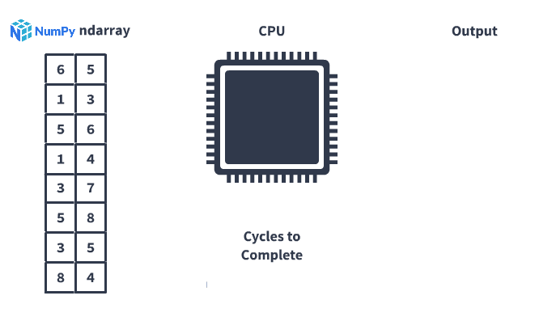
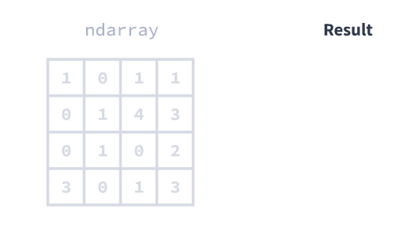

# Introducción a Numpy
Aprenda a trabajar con datos utilizando la biblioteca NumPy.

## 1. Introducción.
Cuando se trata de programar en Python, las bibliotecas son donde está el verdadero poder. Al igual que los complementos o las extensiones, las bibliotecas desbloquean su código y lo hacen más eficiente. 

Con algunos fundamentos de la programación de Python, puede usar bibliotecas para análisis y visualización de datos de alto rendimiento. En esta lección, repasaremos una de las bibliotecas más fáciles de usar que existen: NumPy.


NumPy es muy popular porque facilita la escritura de programas. Python es un lenguaje de alto nivel, lo que significa que no tiene que asignar memoria manualmente. Con los lenguajes de bajo nivel, debe definir la asignación y el procesamiento de la memoria, lo que le brinda más control sobre el rendimiento, pero también ralentiza su programación. NumPy le ofrece lo mejor de ambos mundos: rendimiento de procesamiento sin toda la asignación.


En esta lección, aprenderemos a usar NumPy para trabajar con bases de datos, estadísticas, aprendizaje automático y más, con conjuntos de datos del mundo real, incluidos los datos de viajes en taxi de la ciudad de Nueva York.

Deberá sentirse cómodo con la programación en Python, pero aquí hay algunos puntos que puede esperar en esta lección:

- Cómo las operaciones vectorizadas aceleran su código
- Cómo seleccionar datos de NumPy ndarrays
- Cómo analizar datos usando métodos NumPy

## 2. Introducción a Ndarrays

La estructura de datos central en NumPy es la matriz **ndarray*- o **n-dimensional**. En programación, array describe una colección de elementos, similar a una lista. La palabra **n-dimensional*- se refiere al hecho de que los *ndarrays- pueden tener una o más dimensiones. Comenzaremos trabajando con ndarrays unidimensionales (1D).


Para usar la biblioteca NumPy, primero debemos importarla a nuestro entorno de Python. Es común importar NumPy usando el alias `np`:

```python
import numpy as np
```

Luego, podemos convertir directamente una lista en un ndarray usando el [constructor `numpy.array()`](https://numpy.org/doc/stable/reference/generated/numpy.ndarray.html). Para crear un ndarray 1D, podemos pasar una sola lista:

```python
data_ndarray = np.array([5, 10, 15, 20])
```

Usamos la sintaxis `np.array()` en lugar de `numpy.array()` debido a nuestro código `import numpy as np`. Cuando introduzcamos una nueva sintaxis, siempre usaremos el nombre completo para describirla, y deberá sustituirla por la forma abreviada donde corresponda.

### Ejercicio

Ejecute las instrucciones a continuación.

1. Importe `numpy` y asígnelo al alias `np`.
1. Cree un NumPy ndarray de la lista `[10, 20, 30]`. Asigne el resultado a la variable `data_ndarray`.

## 3. Comprender la vectorización.

Ndarrays y la biblioteca NumPy facilitan la manipulación y el análisis de datos. Exploremos por qué.

Usando Python estándar, podríamos considerar usar listas de listas para representar conjuntos de datos. Si bien las listas de listas funcionan con conjuntos de datos pequeños, no son muy buenas para conjuntos de datos más grandes.

Veamos un ejemplo que involucra dos columnas de datos. Cada fila contiene dos números que queremos sumar. Usando Python estándar, podríamos usar una estructura de lista de listas para almacenar nuestros datos, y podríamos usar bucles for para iterar sobre esos datos:


En cada iteración de nuestro bucle, Python convierte nuestro código en [código de bytes](https://en.wikipedia.org/wiki/Bytecode), y el código de bytes le pide al procesador de nuestra computadora que sume los dos números:


Nuestra computadora necesitaría ocho ciclos de procesador para procesar las ocho filas de nuestros datos.

La biblioteca NumPy aprovecha una característica del procesador llamada **Single Instruction Multiple Data (SIMD)*- para procesar datos más rápido. SIMD permite que un procesador realice la misma operación en múltiples puntos de datos en un solo ciclo de procesador:



Como resultado, usar NumPy solo requeriría dos ciclos de procesador, lo que lo hace cuatro veces más rápido que Python estándar solo. Llamamos a este concepto de reemplazar bucles `for` con operaciones aplicadas a múltiples puntos de datos a la vez **vectorización**, y los ndarrays hacen posible la vectorización.

Exploraremos cómo la vectorización hace que nuestro código sea más rápido y fácil de ejecutar a lo largo de esta lección. 

Practicaremos la conversión de un conjunto de datos del mundo real de una lista de listas a un ndarray.

## 4. Datos de taxis y aeropuertos de la ciudad de Nueva York.

Hasta ahora, solo hemos practicado la creación de ndarrays unidimensionales, pero los ndarrays también pueden ser bidimensionales:


Para explorar los ndarrays bidimensionales (2D), analizaremos los datos de viajes en taxi de la ciudad de Nueva York publicados por la ciudad de Nueva York.


Solo trabajaremos con un subconjunto de estos datos: aproximadamente 90 000 viajes en taxi amarillo hacia y desde los aeropuertos de la ciudad de Nueva York entre enero y junio de 2016. A continuación se incluye información sobre las columnas seleccionadas del conjunto de datos:

- `pickup_year`: el año del viaje
- `pickup_month`: el mes del viaje (enero es `1`, diciembre es `12`)
- `pickup_day`: el día del mes del viaje
- `pickup_location_code`: el aeropuerto o <a href="https://en.wikipedia.org/wiki/Boroughs_of_New_York_City" target="_blank">distrito</a> donde comenzó el viaje
- `dropoff_location_code`: el aeropuerto o distrito donde finalizó el viaje
- `trip_distance`: la distancia del viaje en millas
- `trip_length`: la duración del viaje en segundos
- `fare_amount`: la tarifa base del viaje, en dólares
- `total_amount`: el monto total cobrado al pasajero, incluidas todas las tarifas, peajes y propinas

Puede encontrar información sobre todas las columnas en el diccionario de datos [del conjunto de datos](nyc_taxi_data_dictionary.md).

Nuestros datos están en un [archivo CSV](https://en.wikipedia.org/wiki/Comma-separated_values) llamado `nyc_taxis.csv`. A continuación se muestran las primeras líneas de datos sin procesar en nuestro CSV (estamos mostrando solo las primeras cuatro columnas del archivo para que el formato sea más fácil de entender):

```
pickup_year,pickup_month,pickup_day,pickup_dayofweek
2016,1,1,5
2016,1,1,5
2016,1,1,5
2016,1,1,5
```
Puede notar que también podríamos representar los datos en forma de tabla:

| pickup_year | pickup_month | pickup_day | pickup_dayofweek | pickup_time | pickup_location_code | dropoff_location_code | trip_distance | trip_length | fare_amount | fees_amount | tolls_amount | tip_amount | total_amount | payment_type |
|-------------|--------------|------------|------------------|-------------|----------------------|-----------------------|---------------|-------------|-------------|-------------|--------------|------------|--------------|--------------|
| 2016        | 1            | 1          | 5                | 0           | 2                    | 4                     | 21.00         | 2037        | 52.0        | 0.8         | 5.54         | 11.65      | 69.99        | 1            |
| 2016        | 1            | 1          | 5                | 0           | 2                    | 1                     | 16.29         | 1520        | 45.0        | 1.3         | 0.00         | 8.00       | 54.30        | 1            |
| 2016        | 1            | 1          | 5                | 0           | 2                    | 6                     | 12.70         | 1462        | 36.5        | 1.3         | 0.00         | 0.00       | 37.80        | 2            |
| 2016        | 1            | 1          | 5                | 0           | 2                    | 6                     | 8.70          | 1210        | 26.0        | 1.3         | 0.00         | 5.46       | 32.76        | 1            |
| 2016        | 1            | 1          | 5                | 0           | 2                    | 6                     | 5.56          | 759         | 17.5        | 1.3         | 0.00         | 0.00       | 18.80        | 2            |

¿Esto te parece familiar? Compare esta tabla con el diagrama del ndarray 2D que vimos anteriormente. Puede imaginarse los ndarrays 2D almacenando datos como esta tabla.

Para convertir el conjunto de datos en un ndarray 2D, primero usaremos [el módulo csv](https://docs.python.org/3/library/csv.html) integrado de Python para importar nuestro CSV como una "lista de listas". Luego, convertiremos la lista de listas en un ndarray. Usaremos nuevamente el constructor `numpy.array()`, pero para crear un ndarray 2D, pasaremos nuestra lista de listas en lugar de una sola lista:

```python
# our list of lists is stored as data_list
data_ndarray = np.array(data_list)
```
¡Convirtamos nuestra taxi CSV en un ndarray NumPy!

### Ejercicio

En la siguiente celda, hemos utilizado el módulo `csv` de Python para importar el archivo `nyc_taxis.csv` y convertirlo en una lista de listas que contienen valores flotantes.

1. Agrega una línea de código usando el constructor `numpy.array()` para convertir la variable `convert_taxi_list` en un NumPy ndarray.
1. Asigne el resultado a la variable nombre `taxi`.

## 5. Dimensiones de un arreglo

Veamos los datos en la variable taxi de la pantalla anterior imprimiéndolos usando la función `print()` de Python:

```python
print(taxi)
```

```python
[[  2016      1      1 ...  11.65  69.99      1]
 [  2016      1      1 ...      8   54.3      1]
 [  2016      1      1 ...      0   37.8      2]
 ...
 [  2016      6     30 ...      5  63.34      1]
 [  2016      6     30 ...   8.95  44.75      1]
 [  2016      6     30 ...      0  54.84      2]]
```

Los puntos suspensivos (...) entre filas y columnas indican que hay más datos en nuestro NumPy ndarray de los que se pueden imprimir fácilmente.

Sin embargo, a menudo es útil saber el número de filas y columnas en un ndarray. Cuando no podemos imprimir fácilmente todo el ndarray, podemos usar el atributo [`ndarray.shape`](https://numpy.org/doc/stable/reference/generated/numpy.ndarray.shape.html) en su lugar:

```python
data_ndarray = np.array([[5, 10, 15], 
                         [20, 25, 30]])
print(data_ndarray.shape)
```

```python
(2, 3)
```

El tipo de datos devuelto se denomina tupla. Las tuplas son muy similares a las listas de Python, pero no puedes modificarlas.

La salida nos da algunos datos importantes:

- El primer número nos dice que hay dos filas en data_ndarray.
- El segundo número nos dice que hay tres columnas en data_ndarray.

A continuación, confirmemos el número de filas y columnas en nuestro conjunto de datos.

### Ejercicio

- Asigne la forma de `taxi` a `taxi_shape`. Imprime el resultado.

## 6. Seleccionar y dividir filas y elementos de Ndarrays

A continuación, comparemos el trabajo con ndarrays y la lista de listas para seleccionar una o más filas de datos:


Como vemos arriba, podemos seleccionar filas en ndarrays de manera muy similar a las listas de listas. En realidad, lo que estamos viendo es una especie de atajo. Para cualquier matriz 2D, la sintaxis completa para seleccionar datos es la siguiente:

```python
ndarray[row_index,column_index]

# or if you want to select all
# columns for a given set of rows
ndarray[row_index]
```

...donde `row_index` define la ubicación a lo largo del eje de la fila y `column_index` define la ubicación a lo largo del eje de la columna.

Al igual que las listas, la selección (_slicing_) es desde el primer índice especificado hasta, pero sin incluir, el segundo índice especificado. Por ejemplo, para seleccionar los elementos en el índice 1, 2 y 3, necesitaríamos usar el segmento `[1:4]`.

Así es como seleccionamos un solo elemento de un ndarray 2D:

 

Con una lista de listas, usamos dos pares separados de corchetes uno al lado del otro. Con un NumPy ndarray, **usamos un solo par de corchetes*- con ubicaciones de filas y columnas separadas por comas.

Practiquemos la selección de una fila, varias filas y elementos individuales de nuestro `taxi` ndarray.

### Ejercicio

Desde `taxi` ndarray:

- Seleccione la fila en el índice `0`. Asígnela a `row_0`.
- Seleccione cada columna para las filas en los índices `391` a `500` inclusive. Asígnelos a `rows_391_a_500`.
- Seleccione el elemento en el índice de fila `21` y el índice de columna `5`. Asígnelo a `row_21_column_5`.

## 7. Selección de columnas y secciones de un arrreglo

Sigamos aprendiendo cómo seleccionar una o más columnas de datos:


Con una lista de listas, necesitamos usar un bucle for para extraer columnas específicas y volver a agregarlas a una nueva lista. Con ndarrays, el proceso es mucho más simple. Nuevamente usamos corchetes simples con ubicaciones de filas y columnas separadas por comas, pero usamos dos puntos (:) para las ubicaciones de las filas, lo que nos da todas las filas.

Si queremos seleccionar un segmento 1D parcial de una fila o columna, podemos combinar un solo valor para una dimensión con un segmento para la otra dimensión:


Por último, si queremos seleccionar una sección 2D, podemos usar cortes para ambas dimensiones:


Practiquemos todo lo que hemos aprendido hasta ahora para realizar algunas selecciones más complejas usando NumPy.

### Ejercicio

De `taxi` ndarray:

- Seleccione cada fila para las columnas en los índices `1`, `4` y `7`. Asígnelas a las `columns_1_4_7`.
- Seleccione las columnas en los índices `5` a `8` inclusive para la fila en el índice `99`. Asígnelas a `row_99_columns_5_to_8`.
- Seleccione las filas en los índices `100` a `200` inclusive para la columna en el índice `14`. Asígnelas a `rows_100_to_200_column_14`.

## 8. Matemáticas vectoriales.

Como vimos anterioriormente, los NumPy ndarrays nos permiten seleccionar datos con mucha más facilidad. Más allá de esto, la selección es mucho más rápida cuando se trabaja con **operaciones vectorizadas** porque las operaciones se aplican a varios puntos de datos a la vez.

Cuando hablamos por primera vez sobre operaciones vectorizadas, usamos el ejemplo de agregar dos columnas de datos. Con datos en una lista de listas, tendríamos que construir un ciclo for y agregar cada par de valores de cada fila individualmente:


En ese momento, solo hablamos sobre cómo las operaciones vectorizadas hacen que esto sea más rápido; sin embargo, las operaciones vectorizadas también hacen que nuestro código sea más fácil de ejecutar. Así es como realizaríamos la misma tarea anterior con operaciones vectorizadas:

```python
# convert the list of lists to an ndarray
my_numbers = np.array(my_numbers)

# select each of the columns - the result
# of each will be a 1D ndarray
col1 = my_numbers[:,0]
col2 = my_numbers[:,1]

# add the two columns
sums = col1 + col2
```

Podríamos simplificar esto aún más si quisiéramos:

```python
sums = my_numbers[:,0] + my_numbers[:,1]
```

Aquí hay algunas observaciones clave sobre este código:

- Cuando seleccionamos cada columna, usamos la sintaxis `ndarray[:,c]` donde `c` es el índice de columna que queríamos seleccionar. Como vimos antes, los _dos puntos_ seleccionan todas las filas.
- Para sumar los dos ndarrays 1D, `col1` y `col2`, simplemente usamos el operador de suma `(+)` entre ellos.

Esto es lo que sucedió:


El resultado de sumar dos ndarrays 1D es un ndarray 1D de la misma forma (o dimensiones) que el original. En este contexto, también podemos llamar vectores ndarrays, un término del álgebra lineal. A la suma de dos vectores la llamamos suma de vectores.

### Ejercicio

- Use la suma de vectores para agregar `fare_amount` y `fees_amount`. Asigne el resultado a `fare_and_fees`.
- Imprima las variables.

## 9. Matemáticas vectoriales (continuación)

Usamos la suma de vectores para sumar dos columnas (o vectores). De hecho, podemos usar cualquiera de los [operadores numéricos estándar](https://docs.python.org/3/library/stdtypes.html#numeric-types-int-float-complex) de Python con vectores, incluidos los siguientes:

- `vector_a` + `vector_b` &mdash;suma
- `vector_a` - `vector_b` &mdash;resta
- `vector_a` * `vector_b` &mdash;multiplicación (esto no está relacionado con la multiplicación de vectores utilizada en álgebra lineal).
- `vector_a` / `vector_b` &mdash;división

Cuando realizamos estas operaciones en dos vectores 1D, ambos vectores deben tener la misma forma.

Veamos otro ejemplo de nuestro conjunto de datos de taxis. Aquí están las primeras cinco filas de dos de las columnas en el conjunto de datos:

| trip_distance | trip_length  |
|---------------|--------------|
| 21.00         | 2037.0       |
| 16.29         | 1520.0       |
| 12.70         | 1462.0       |
| 8.70          | 1210.0       |
| 5.56          | 759.0        |

Usemos estas columnas para calcular la velocidad de viaje promedio de cada viaje en millas por hora. Esta es la fórmula para calcular millas por hora:

$$\text{miles per hour} = \text{distance in miles} \div \text{length in hours}
$$

Como aprendimos anteriormente en esta lección, `trip_distance` ya se expresa en millas, pero `trip_length` se expresa en segundos. Primero, convertiremos `trip_length` en horas:

```python
trip_distance = taxi[:,7]
trip_length_seconds = taxi[:,8]

trip_length_hours = trip_length_seconds / 3600 # 3600 seconds is one hour
```

En este caso, dividimos cada valor del vector por un solo número, 3600, en lugar de otro vector. A continuación se muestran las primeras cinco filas del resultado:

| trip_length_hours  |
|--------------------|
| 0.565833           |
| 0.422222           |
| 0.406111           |
| 0.336111           |
| 0.210833           |

Realicemos de nuevo la división de vectores para calcular las millas por hora.

### Ejercicio

- Utilice la división de vectores para `dividir trip_distance_miles` por `trip_length_hours`. Asigne el resultado a `trip_mph`.
- Imprima el contenido de la nueva variable `trip_mph`.

## 10. Cálculo de estadísticas para matrices 1D

En la sección anterior, creamos `trip_mph`, un ndarray 1D de la velocidad promedio en millas por hora de cada viaje en nuestro conjunto de datos. A continuación, exploraremos más estos datos y calcularemos los valores mínimo, máximo y medio para `trip_mph`.

Para calcular el valor mínimo de un ndarray 1D, usamos el método vectorizado [`ndarray.min()`](https://numpy.org/doc/stable/reference/generated/numpy.ndarray.min.html), así:

```python
mph_min = trip_mph.min()
print(mph_min)
```

```python
0.0
```

El valor mínimo en nuestro `trip_mph` ndarray es 0.0, para un viaje que no recorrió ninguna distancia.

NumPy ndarrays tiene métodos para muchos cálculos diferentes. Estos son algunos de los métodos:

- ndarray.min() para calcular el valor mínimo
- [ndarray.max() para calcular el valor máximo](https://numpy.org/doc/stable/reference/generated/numpy.ndarray.max.html)
- [ndarray.mean() para calcular el valor medio o promedio](https://numpy.org/doc/stable/reference/generated/numpy.ndarray.mean.html)
- [ndarray.sum()](https://numpy.org/doc/stable/reference/generated/numpy.ndarray.sum.html) para calcular la suma de los valores

Puede ver la lista completa de métodos ndarray en la [documentación de NumPy ndarray](https://numpy.org/doc/stable/reference/arrays.ndarray.html).

Es importante familiarizarse con la documentación porque no es posible recordar la sintaxis para cada variación de cada biblioteca de ciencia de datos. Sin embargo, si recuerda lo que es posible y puede leer la documentación, siempre podrá volver a familiarizarse con ella cuando lo necesite.

Cada vez que vea la sintaxis `ndarray.method_name()`, sustituya `ndarray` con el nombre de su ndarray (en este caso, `trip_mph`) así:


Usemos lo que acabamos de aprender para calcular la velocidad máxima y media (promedio) de nuestro ndarray `trip_mph`.

### Ejercicio

1. Utilice el [método `ndarray.max()`](https://numpy.org/doc/stable/reference/generated/numpy.ndarray.max.html) para calcular el valor máximo de `trip_mph`. Asigne el resultado a `mph_max`.
1. Usa el [método `ndarray.mean()`](https://numpy.org/doc/stable/reference/generated/numpy.ndarray.mean.html) para calcular el valor promedio de `trip_mph`. Asigne el resultado a `mph_mean`.

## 11. Cálculo de estadísticas para matrices 1D (continuación)

Mirando el resultado del código anterior, podemos ver lo siguiente:

- Velocidad de viaje promedio (media) (redondeada): 170 mph
- Velocidad máxima de viaje (redondeada): 82,000 mph

Una velocidad de viaje de 82,000 mph definitivamente no es posible en el tráfico de Nueva York, ¡eso es casi 20 veces más rápido que el avión más rápido del mundo! Y la velocidad de viaje promedio de 170 mph tampoco es posible. Estos resultados podrían deberse a errores en los dispositivos que registran los datos, o quizás a errores cometidos en algún lugar de la canalización de datos.

Antes de ver otros métodos de matriz, revisemos la diferencia entre métodos y funciones. **Las funciones** actúan como segmentos independientes de código que normalmente toman una entrada, realizan algún procesamiento y devuelven alguna salida. Por ejemplo, podemos usar la función `len()` para calcular el número de elementos de una lista o el número de caracteres en una cadena.

```python
my_list = [21,14,91]
print(len(my_list))
```

```python
3
```

```python
my_string = 'Dataquest'
print(len(my_string))
```

```python
9
```

Por el contrario, los métodos son funciones especiales que pertenecen a un tipo específico de objeto. Esto significa que, por ejemplo, cuando trabajamos con objetos de lista, hay funciones o métodos especiales que solo podemos usar con listas. Por ejemplo, podemos usar el método `list.append()` para agregar un elemento al final de una lista. Si intentamos usar ese método en una cadena, obtendremos un error como este:

```python
my_string.append(' is the best!')
```

```python
Traceback (most recent call last):
    File "stdin", line 1, in module
AttributeError: 'str' object has no attribute 'append'
```

En NumPy, a veces las operaciones se implementan como métodos y funciones, lo que puede resultar confuso. Veamos algunos ejemplos:

| **Cálculo** | **Representación de funciones** | **Representación del método** |
|-----------------------------| --------------------------------------------|--------------------------------------|
| Calcular el valor mínimo de `trip_mph` | `np.min(trip_mph)` | `trip_mph.min()` |
| Calcular el valor máximo de `trip_mph` | `np.max(trip_mph)` | `trip_mph.max()` |
| Calcule el [valor promedio](https://en.wikipedia.org/wiki/Mean) de `trip_mph` | `np.mean(trip_mph)` | `trip_mph.mean()` |
| Calcule [la mediana](https://en.wikipedia.org/wiki/Median) `trip_mph` | `np.median(trip_mph)` | No existe un método de mediana ndarray |


Para recordar la terminología correcta, cualquier cosa que comience con `np` (p. ej., `np.mean()`) es una función, y cualquier cosa que se exprese primero con el nombre de un objeto (o variable) (p. ej., `trip_mph.mean()`) es un método. Cuando existen ambos, depende de usted decidir cuál usar, pero es mucho más común usar el enfoque de método.

## 12. Cálculo de estadísticas para arreglos 2D

A continuación, calcularemos estadísticas para ndarrays 2D. Si usamos el método `ndarray.max()` en un ndarray 2D sin ningún parámetro adicional, devolverá un solo valor, como una matriz 1D:



Pero, ¿y si queremos encontrar el valor máximo de cada fila? Necesitamos usar el parámetro del eje y especificar un valor de 1 para indicar que queremos calcular el valor máximo para cada fila.


Si queremos encontrar el valor máximo de cada columna, usaríamos un valor de eje de 0:


Usemos lo que hemos aprendido para verificar los datos en nuestro conjunto de datos de taxis. Para recordar cómo se ven los datos, examinemos las primeras cinco filas de las columnas con índices del 9 al 13:

| **fare_amount** | **fees_amount** | **tolls_amount** | **tip_amount** | **total_amount** |
|-----------------|-----------------|------------------|----------------|------------------|
| 52.0            | 0.8             | 5.54             | 11.65          | 69.99            |
| 45.0            | 1.3             | 0.00             | 8.00           | 54.3             |
| 36.5            | 1.3             | 0.00             | 0.00           | 37.8             |
| 26.0            | 1.3             | 0.00             | 5.46           | 32.76            |
| 17.5            | 1.3             | 0.00             | 0.00           | 18.8             |

Es posible que haya notado que la suma de los primeros cuatro valores en cada fila debe ser igual al último valor, cantidad_total:

$$\text{fare amount} + \text{fees amount} + \text{tolls amount} +\text{tip amount} = \text{total amount}
$$

En el siguiente ejercicio, comprobaremos estos valores. Solo revisaremos las primeras cinco filas en `taxi` para que podamos verificar los resultados más fácilmente.

### Ejercicio

Asigne las primeras cinco filas de `taxi` a `taxi_first_five` y las primeras cuatro columnas de la tabla anterior a `fare_components`.

Compruebe si la suma de cada fila en `fare_components` es igual al valor de la columna `total_amount`.

1. Utilice el método `ndarray.sum()` para calcular la suma de cada fila en `fare_components`. Asigne el resultado a `fare_sums`.
1. Extraiga la columna 14 en `taxi_first_five`. Asignar a `fare_totals`.
1. Imprimir `fare_totals` y `fare_sums`. Imprima el resultado y verifique que los resultados coincidan.

## Próximos pasos

En esta lección, aprendimos lo siguiente:

- Cómo la vectorización acelera nuestro código
- Acerca de los arreglos n-dimensionales y los ndarrays de NumPy
- Cómo seleccionar elementos específicos, filas, columnas, secciones 1D y secciones 2D de ndarrays
- Cómo aplicar cálculos simples a ndarrays completos
- Cómo usar métodos vectorizados para realizar cálculos en cualquiera de los ejes de ndarrays

En la próxima lección, continuaremos trabajando con los datos de los taxis de la ciudad de Nueva York a medida que aprendemos sobre la **indexación booleana**, una de las herramientas más poderosas cuando se trabaja con datos en NumPy y pandas.